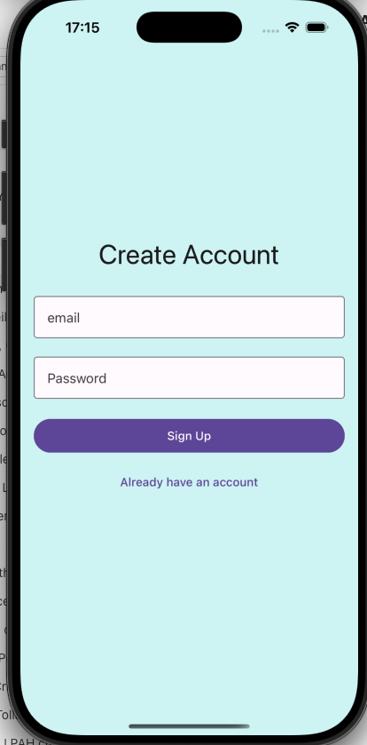
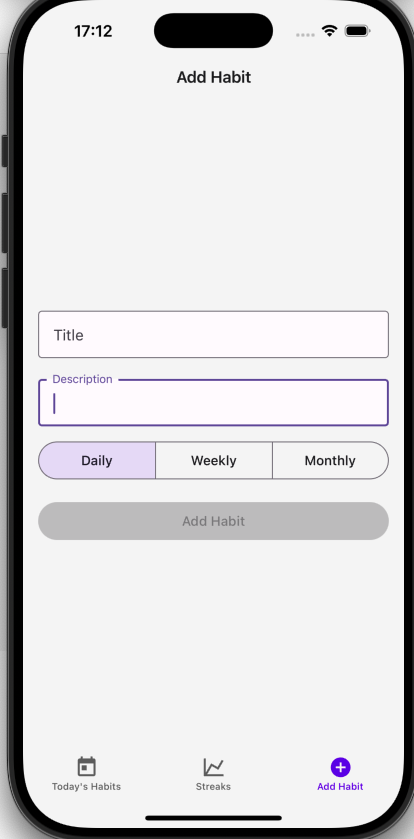

# Welcome to your Expo app 👋

This is an [Expo](https://expo.dev) project created with [`create-expo-app`](https://www.npmjs.com/package/create-expo-app).

## Get started

1. Install dependencies

   ```bash
   npm install
   ```

2. Start the app

   ```bash
   npx expo start
   ```

3. Open it in a simulator or on your device

   - For iOS, press `i` to open in the iOS simulator.
   - For Android, press `a` to open in the Android emulator or scan the QR code with the Expo Go app on your device.

4. Create .env.local

## Login




## Create Habit



## Top habits


## Today Habits


## Features

- Login and Signup
- Create Habit
- View Top Habits
- View Today Habits
- Complete Habits
- Delete Habits
- Ranking of Habits

## Ecosystem

- [Expo](https://expo.dev) for building and deploying the app.
- [React Navigation](https://reactnavigation.org) for navigation.
- [Appwrite](https://docs.expo.dev/versions/latest/sdk/appwrite/) for backend services.
- [React Native Paper](https://callstack.github.io/react-native-paper/) for UI components.

## Directory Structure

```
.
├── assets/               # Images and other static assets
├── components/           # Reusable components
├── constants/            # Constants used throughout the app
├── api/                  # API calls and services
├── libs/                 # Utility functions and libraries
├── utils/                # Utility functions
├── types/                # Type definitions for different app components
```
